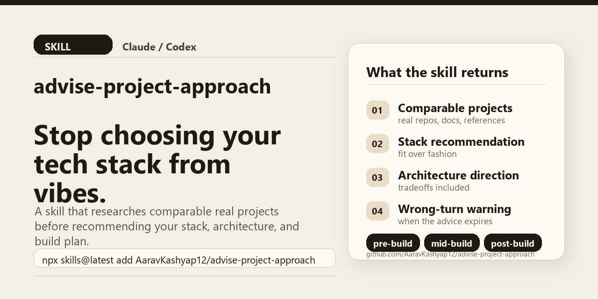

# advise-project-approach

> A Claude/Codex skill that researches the best way to build your project before you commit to the wrong stack.



You know that friend who has built fifteen projects, read every ADR ever written, and will tell you "actually, don't use Kafka for this" before you have even opened your editor?

This is that friend. As a skill.

## One-Line Install

```bash
npx skills@latest add AaravKashyap12/advise-project-approach --skill advise-project-approach
```

This uses the open `skills` installer to fetch the repo from GitHub and install only this skill. It requires Node.js/npm. Review installed skills before use; skills run with your agent's normal permissions.

## Try These Prompts

```text
"What's the best way to build a self-hosted bookmark manager?"
"Research comparable projects before I start this."
"I'm halfway through building a Node/Express API. Is my approach right?"
"Review my finished project at github.com/owner/repo."
"Should I use Postgres or SQLite for this?"
"What stack should I use given I know Python and want to self-host?"
```

## What It Does

Drop it into your agent and it will:

- **Pre-build:** Research your stack, find comparable real projects, compare architecture options, and hand you a build plan before you commit to anything you will regret in month three.
- **Mid-build:** Inspect your repo, identify what is actually wrong, not just what is fashionable to fix, and give you a prioritized list of changes ordered by impact.
- **Post-build:** Review your finished project against mature comparables, call out the gaps, and tell you what to harden before you ship.

It does the research loop a good engineer would do manually: understand the goal, inspect the evidence, study credible comparables, evaluate the tradeoffs, and recommend the highest-leverage path.

No vibes. Evidence first.

## Install

### Recommended

```bash
npx skills@latest add AaravKashyap12/advise-project-approach --skill advise-project-approach
```

To list the skill without installing:

```bash
npx skills@latest add AaravKashyap12/advise-project-approach --list
```

### Manual Download

Download the packaged skill:

[dist/advise-project-approach.skill](./dist/advise-project-approach.skill)

Or install from the GitHub release:

[v0.1.0 release asset](https://github.com/AaravKashyap12/advise-project-approach/releases/download/v0.1.0/advise-project-approach.skill)

#### Skill UI

1. Download `dist/advise-project-approach.skill`.
2. Open your agent's skill settings.
3. Upload the `.skill` file.
4. Start a new conversation.

#### Local Skill Folder

If your agent supports local skill folders:

```bash
cp -r skills/advise-project-approach ~/.claude/skills/
```

For Codex-style local installs, copy or symlink `skills/advise-project-approach` into your supported skills directory.

### Plugin Metadata

This repo also includes `.claude-plugin/plugin.json` for plugin-aware installers that can read skill collections from GitHub repositories.

## Demo

```text
You: I want to build a self-hosted bookmark manager. Solo dev, Python background, want tags and full-text search.

Agent, with skill: researches linkding, Linkwarden, LinkAce, official framework docs, and relevant search/storage options.

## Project Approach: Self-Hosted Bookmark Manager

### TL;DR
Go with Django + SQLite FTS5 or Postgres full-text search, depending on your hosting target and expected scale. Keep the main UI server-rendered with HTMX, Turbo, or light JavaScript unless the UI needs true SPA complexity. This matches your Python skills, keeps deployment simple, and is backed by nearby real projects like linkding.

### Comparable Projects
1. linkding - github.com/sissbruecker/linkding; Django, DRF, Huey, Turbo/Lit, Docker, optional Postgres; nearest domain match; limits: current details must be verified at review time.
2. Linkwarden - github.com/linkwarden/linkwarden; heavier collaborative bookmark manager; useful contrast for when archiving/collaboration matter more than simplicity.
3. LinkAce - linkace.org; mature self-hosted bookmark manager in a different stack; useful for feature comparison, less useful for implementation fit.
```

The demo avoids hard-coded star counts and "latest" dates because those decay. The skill requires the agent to verify those values at review time.

See more examples:

- [Pre-build bookmark manager](./examples/prebuild-bookmark-manager.md)
- [Mid-build Express API](./examples/midbuild-express-api.md)
- [Post-build FastAPI template](./examples/postbuild-fastapi-template.md)

## Why This Is Different From Just Asking

Without the skill, an agent will usually give you an answer. This skill makes it give you an accountable answer:

- Every "active" or "maintained" claim needs an exact date or adoption signal.
- Comparable projects are verified against real repos, docs, or other primary sources.
- If no repo was provided, it says "advisory from description" instead of pretending it inspected files.
- The recommendation includes when it becomes the wrong recommendation.
- A self-check runs before output: is this grounded in actual project constraints, or is it generic?

## What It Produces

### Pre-Build

```text
## Project Approach: <name>
TL;DR / Project Frame / Comparable Projects / Recommended Stack /
Architecture Direction / Alternatives Considered / Build Plan /
Risks and Unknowns / References
```

### Mid-Build or Post-Build

```text
## Project Approach Review: <name>
TL;DR / Project Summary / Evidence Reviewed, including evidence status /
What Is Working / Comparable Projects / Gap Analysis /
Recommended Changes, grouped High / Medium / Low /
Stack and Architecture Verdict / Risks and References
```

## What It Will Not Do

- Invent star counts, last-commit dates, benchmark numbers, or production adoption claims.
- Pretend it reviewed files when you only gave it a description.
- Tell you to add auth, tests, or Docker if you already have them.
- Recommend something because it is trending instead of because it fits your constraints.
- Give a production-grade review to a weekend prototype without calibrating the advice.

## Repo Structure

```text
.
|-- README.md
|-- LICENSE
|-- CHANGELOG.md
|-- CONTRIBUTING.md
|-- SECURITY.md
|-- CLAUDE.md
|-- assets/
|   `-- social-preview.png
|-- .claude-plugin/
|   `-- plugin.json
|-- .github/
|   `-- workflows/
|       `-- validate.yml
|-- dist/
|   `-- advise-project-approach.skill
|-- skills/
|   `-- advise-project-approach/
|       |-- SKILL.md
|       `-- agents/
|           `-- openai.yaml
|-- examples/
|   |-- prebuild-bookmark-manager.md
|   |-- midbuild-express-api.md
|   `-- postbuild-fastapi-template.md
|-- scripts/
|   |-- generate_social_preview.py
|   |-- package_skill.py
|   `-- validate_skill.py
`-- tests/
    `-- validation-notes.md
```

The packaged `.skill` file is a zip archive containing the `advise-project-approach/` skill folder.

## Development

Validate and rebuild the package:

```bash
python scripts/validate_skill.py
python scripts/package_skill.py
python scripts/validate_skill.py
```

The GitHub Actions workflow runs the same checks and fails if the generated package differs from what is committed.

Regenerate the launch/social preview image:

```bash
python scripts/generate_social_preview.py
```

## Tested Against

| Repo | What it exposed |
| --- | --- |
| [linkding](https://github.com/sissbruecker/linkding) | Freshness rules: the skill must not flatten a mature project's current stack into an older, simpler version. |
| [gothinkster/node-express-realworld-example-app](https://github.com/gothinkster/node-express-realworld-example-app) | Repo evidence: do not recommend "add auth/tests" when the repo already has them. |
| [fastapi/full-stack-fastapi-template](https://github.com/fastapi/full-stack-fastapi-template) | Fit judgment: distinguish "this is a good template" from "this is right for your user and scale." |

See [tests/validation-notes.md](./tests/validation-notes.md) for the validation notes.

## Contributing

Issues and PRs are welcome. The most useful contributions are:

- New repo test cases: a repo, what the skill got wrong, and what it should have said.
- Evidence discipline failures: cases where a claim was made without a verifiable source.
- Mode selection bugs: cases where the skill picked the wrong operating mode.

## License

MIT
